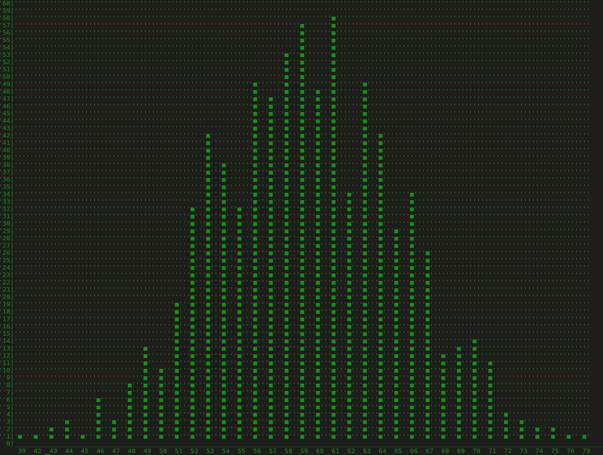
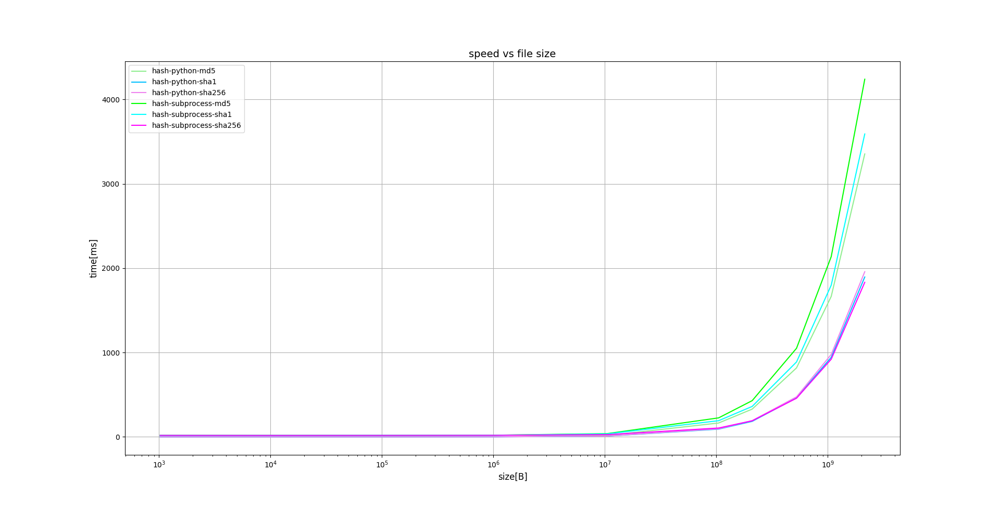

# tipts
Scripts, tips and any other stuff that might useful in your programming journey

It contains:
  - plotting charts
  - files operations
  - example of decorator, tkinter-gui, smtp
  - terminal histogram
  - working with pdf files
  - benchmarks
  - tips for deployment Python package on pypi.org
  - and many others

## screen from console histogram, my early application

## benchmarks

